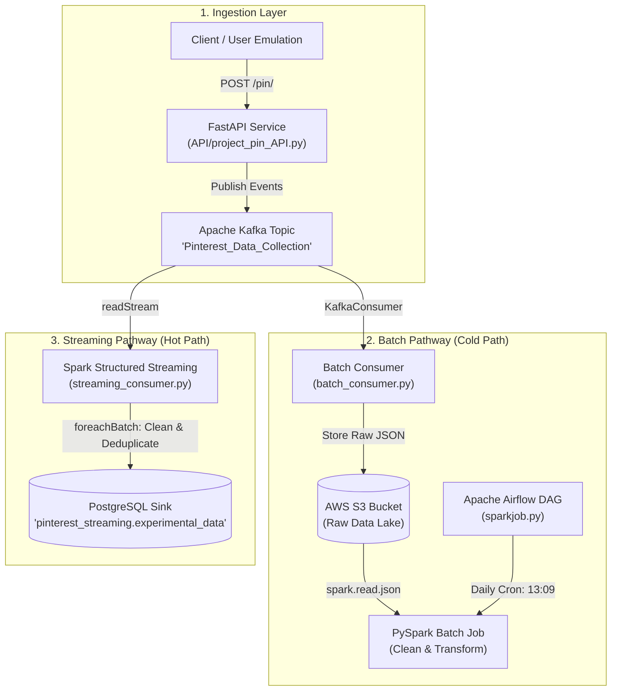

# 📌 Pinterest Data Processing Pipeline

[](https://www.python.org/)
[](https://fastapi.tiangolo.com/)
[](https://kafka.apache.org/)
[](https://spark.apache.org/)
[](https://www.postgresql.org/)
[](https://airflow.apache.org/)
[](https://aws.amazon.com/s3/)

An end-to-end Big Data pipeline inspired by Pinterest's data infrastructure. The system ingests high-throughput user engagement data and processes it using a **Lambda Architecture**, enabling both scheduled batch analysis across massive historical datasets and low-latency stream processing for real-time analytics.

---

## 🏗️ Architecture Overview



---

## ✨ Features

- **High-Throughput Ingestion**: FastAPI gateway with Pydantic validation producing messages directly to an Apache Kafka cluster.
- **Dual Pipeline (Lambda Architecture)**:
  - **Batch Processing**: Periodically transforms historical raw JSON dumps residing in AWS S3 with PySpark and schedules execution with Apache Airflow.
  - **Real-Time Stream Processing**: Uses Spark Structured Streaming to process Kafka micro-batches on the fly and write cleaned data into a PostgreSQL relational store.
- **Robust Data Cleaning & Normalization**: Standardizes non-uniform follower counts (e.g., `"12k"` $\rightarrow$ `12000`, `"5M"` $\rightarrow$ `5000000`), strips prefixes, normalizes empty strings to `null`, and casts types safely.
- **Automated Workflow Orchestration**: Airflow DAG with custom operators and scheduled triggers for reliable data transformations.

---

## 🛠️ Tech Stack

| Domain | Technology | Purpose |
| :--- | :--- | :--- |
| **API Gateway** | [FastAPI](https://fastapi.tiangolo.com/), [Uvicorn](https://www.uvicorn.org/) | Ingestion REST endpoint (`/pin/`) |
| **Message Broker** | [Apache Kafka](https://kafka.apache.org/) | Distributed pub/sub streaming buffer |
| **Data Lake** | [Amazon S3](https://aws.amazon.com/s3/) (Boto3) | Raw immutable JSON storage |
| **Batch Processing** | [Apache Spark](https://spark.apache.org/) (PySpark) | Large-scale ETL data transformation |
| **Stream Processing** | [Spark Structured Streaming](https://spark.apache.org/docs/latest/structured-streaming-programming-guide.html) | Near-real-time micro-batch ingestion and transformation |
| **Data Sink** | [PostgreSQL](https://www.postgresql.org/) | Analytical store for real-time data |
| **Orchestrator** | [Apache Airflow](https://airflow.apache.org/) | Scheduling and dependency management for batch pipelines |

---

## 📁 Repository Structure

```text
pinterest-data-processing-pipeline/
│
├── API/
│   └── project_pin_API.py     # FastAPI app receiving pin data and producing to Kafka
│
├── batch_consumer.py          # Kafka batch consumer uploading to S3 & PySpark batch ETL
├── sparkjob.py                # Airflow DAG definition and analytical helper queries
├── streaming_consumer.py      # Spark Structured Streaming job writing to PostgreSQL
└── README.md                  # Project documentation
```

---

## 🧹 Data Cleaning & Transformation Pipeline

Both the batch and streaming paths apply the following transformations to standardize raw inputs:

| Field | Raw Format Example | Transformation Logic | Result |
| :--- | :--- | :--- | :--- |
| `follower_count` | `"15k"` / `"2M"` | Replaces `"k"` with `"000"`, `"M"` with `"000000"` | `15000` / `2000000` (`Integer`) |
| `follower_count` | `"User Info Error"` | Replaced with `"None"` before integer cast | `null` |
| `tag_list` | `"N,o, ,T,a,g,s, ,A,v,a,i,l,a,b,l,e"` | Replaced with `"None"` | `null` |
| `title`, `description`, `image_src` | `""` (empty string) | `f.when(col(...) == "", None)` | `null` |
| `save_location` | `"Local save in /path..."` | Strips `"Local save in "` prefix | Cleaned relative/absolute path |
| `index`, `downloaded` | `"1"`, `"0"` | Direct cast to integer | `Integer` |

---

## 🚀 Getting Started

### 1. Prerequisites

Ensure the following dependencies are installed and configured:
- **Python 3.8+**
- **Java 8 or 11** (required by Apache Spark)
- **Apache Kafka** (running on `localhost:9092`)
- **Apache Spark 3.3+** with Hadoop-AWS packages
- **PostgreSQL** (running on `localhost:5432`)
- **AWS CLI** configured (`aws configure`) with access to the target S3 bucket
- **Apache Airflow** (optional, for scheduled batch runs)

---

### 2. Installation

Clone the repository and install the Python dependencies:

```bash
git clone https://github.com/balany1/pinterest-data-processing-pipeline.git
cd pinterest-data-processing-pipeline
pip install fastapi uvicorn kafka-python pyspark boto3 psycopg2-binary apache-airflow
```

---

### 3. Running the Pipeline

#### Step A: Start Apache Kafka & Zookeeper
Start Zookeeper and the Kafka broker on default port `9092`:
```bash
# Start Zookeeper
bin/zookeeper-server-start.sh config/zookeeper.properties

# Start Kafka Broker
bin/kafka-server-start.sh config/server.properties
```

Ensure the topic exists:
```bash
bin/kafka-topics.sh --create --topic Pinterest_Data_Collection --bootstrap-server localhost:9092 --partitions 1 --replication-factor 1
```

---

#### Step B: Launch the Ingestion API
Start the FastAPI server:
```bash
python API/project_pin_API.py
```
*The endpoint will be active at `http://localhost:8000`. You can inspect the Swagger documentation at `http://localhost:8000/docs`.*

To test posting a record:
```bash
curl -X POST "http://localhost:8000/pin/" \
     -H "Content-Type: application/json" \
     -d '{
       "category": "travel",
       "index": 1,
       "unique_id": "pin-001",
       "title": "Top Paris Attractions",
       "description": "Eiffel Tower and Louvre",
       "follower_count": "15k",
       "tag_list": "travel,france,paris",
       "is_image_or_video": "image",
       "image_src": "https://example.com/paris.jpg",
       "downloaded": 1,
       "save_location": "Local save in /images/paris.jpg"
     }'
```

---

#### Step C: Run the Batch Processing Pathway

1. **Consume from Kafka and upload to AWS S3:**
   ```bash
   python -c "from batch_consumer import Batch_Processing; b = Batch_Processing(); b.Batch_Consumer()"
   ```
2. **Execute PySpark Batch Cleaning directly:**
   ```bash
   python -c "from batch_consumer import Batch_Processing; b = Batch_Processing(); b.spark()"
   ```
3. **Orchestrate with Airflow**:
   Place `sparkjob.py` into your Airflow DAGs directory (`~/airflow/dags`) and start the Airflow webserver and scheduler:
   ```bash
   airflow webserver --port 8080
   airflow scheduler
   ```

---

#### Step D: Run the Real-Time Streaming Pathway

Create the target database in PostgreSQL:
```sql
CREATE DATABASE pinterest_streaming;
```

Run the Spark Structured Streaming consumer:
```bash
python streaming_consumer.py
```
*Data will be consumed live from Kafka, transformed in micro-batches, and written into the `experimental_data` table in PostgreSQL.*

---

## 🔒 Security & Best Practices Note

- **Credentials Management**: Avoid hardcoding AWS credentials and database passwords in source code. Use environment variables or AWS Secrets Manager / `.env` files via `python-dotenv`.
- **Checkpointing**: In production, supply a `.option("checkpointLocation", "...")` in Structured Streaming to ensure fault tolerance and exactly-once semantics.
